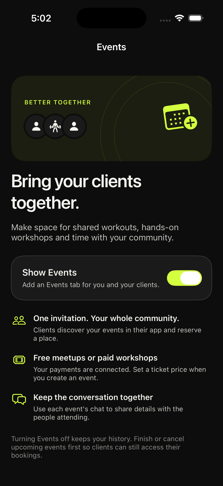
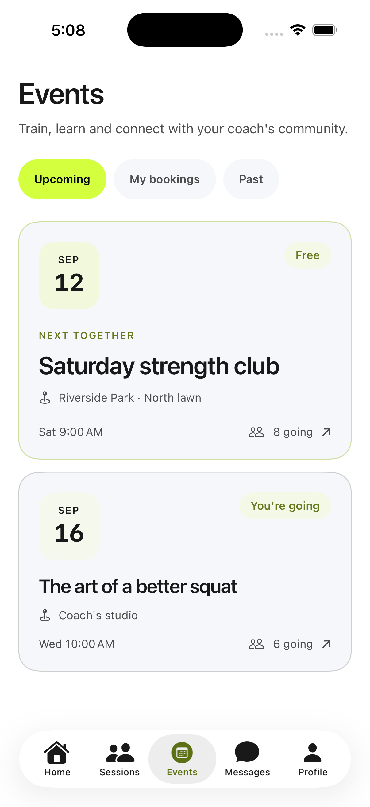
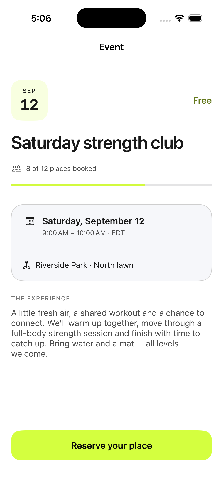

# Eventos para personal trainers

Eventos es una ampliación opcional del servicio del entrenador: entrenamientos en grupo,
talleres y encuentros privados para sus clientes. La navegación principal mantiene Home,
Clients/Sessions, Messages y Profile; activar Events en Ajustes añade la quinta pestaña.

La interfaz usa las superficies, tipografía y color de marca del ecosistema de coaching.
Incluye estados vacíos, tarjetas de fecha, cupos, reservas, entradas de pago y conversación
del evento, reutilizando los servicios existentes.

## Configuración y contrato

- La preferencia pertenece al workspace, está apagada por defecto y solo OWNER/ADMIN la cambia.
- `GET /context/workspace` incluye el objeto opcional `pt_events`.
- `GET/PUT /context/workspace/events`, con `X-Gym-ID`, consulta o guarda `{"enabled": true}`.
- Los módulos gratuitos se activan desde Ajustes. Los premium requieren un permiso existente.
- Las entradas de pago solo se ofrecen con facturación habilitada y Stripe Connect listo para cobrar.
- Apagar la preferencia conserva el historial. El servidor responde 409 si quedan eventos pendientes.
- Los cambios se guardan en el servidor y los clientes los actualizan al volver a la app.

Publicar primero el backend con la migración aditiva `f902c5a713ab`, que añade
`gyms.pt_events_enabled` con valor por defecto `false`. La nueva app tolera un backend anterior
sin `pt_events`, mostrando la opción como no disponible.

## Validación

En el repositorio del backend: `pytest tests/training/test_pt_events.py -q` comprueba acceso,
roles, activación gratuita/premium, pagos y protección del historial (13 casos).

Los modelos reales de iOS tienen comprobaciones independientes para 18 importes localizados,
el contrato del workspace y 8 estados de reserva:

```sh
swiftc Gym_API/Models/Event.swift Gym_API/Models/EventParticipation.swift \
  Gym_API/Models/Coaching/PTEventsState.swift Gym_API/Models/Coaching/EventTicketAmount.swift \
  Scripts/check-pt-events.swift -o /tmp/gymapi-pt-events-checks
/tmp/gymapi-pt-events-checks
```

La compilación del simulador y el archivo Release sin firma pasan. El esquema existente de Xcode apunta a paquetes de tests
que no existen como targets; `xcodebuild test` devuelve «There are no test bundles available».
La suite ampliada del backend obtuvo 520 casos correctos; dos fallos de perfil y tres errores
dependientes también se reproducen sin este cambio, por conexiones fuera de los fixtures.

Producción: backend `c8cc9b1`, despliegue Render `dep-dagskrmk1f9s73dpcbng`, activo el
9 de septiembre de 2026. Verificados la revisión `f902c5a713ab`, columna no nula con
default `false`, respuesta HTTP 200, ambos endpoints en OpenAPI y rechazo 403 sin sesión.

## Revisión visual

En Debug, iniciar con `-coaching-events-gallery settings`, `settings-off`, `settings-error`,
`unavailable`, `coach`, `client`, `create`, `detail` o `empty`. Se muestran las vistas reales
con datos locales; la galería no está incluida en Release.





## Distribución iOS

Publicar código y desplegar la API no actualiza los binarios instalados. El archivo de
distribución necesita un equipo de Apple Developer que admita Push Notifications y acceso
a App Store Connect. El equipo personal configurado en Xcode rechazó el archivo firmado
durante esta entrega por esa capacidad; no se retiraron los permisos de notificaciones.
